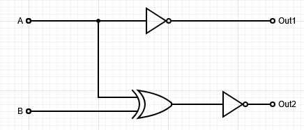
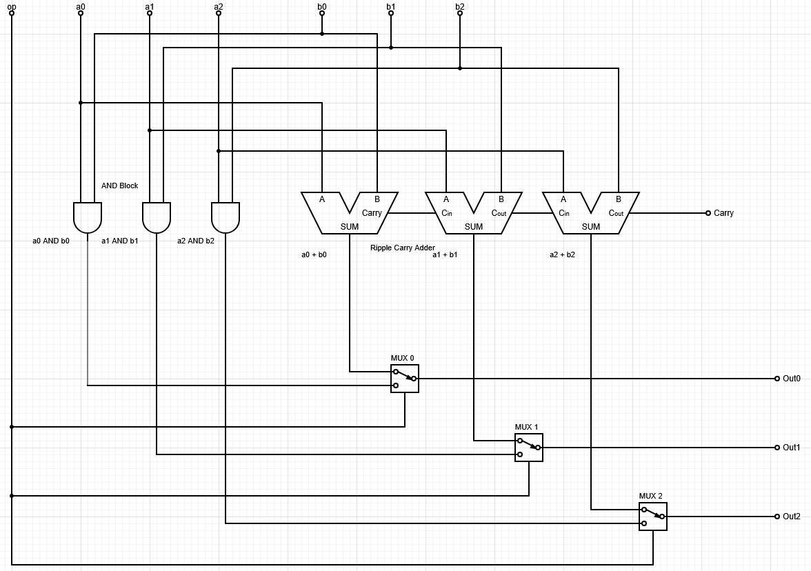

# Unit Test 2 Review Questions
## Due: 4/19/26

## Description

This study guide will highlight the topics covered on the Unit 2 Test. Primarily, it focused on circuits and gates and the building up of abstraction. As such it was based on the below lessons, however keep in mind that the topics are cumulative in nature and build on all previous lessons as well:

- Signed Numbers and Bit Patterns
	- [Signed Representations](../lessons/5_signed_unsigned.md)
- The Abstraction Hierarchy
    - [Introduction](../lessons/1_introduction.md)
    - [C Compilation Lab](../labs/c_compilation.md)
    - [Transistors To Computers](../lessons/6_transistors_2_pc.md)
- Logical Gates
	- [Boolean Logic](../lessons/4_bool_logic.md)
	- [Gates and Circuits](../lessons/7_gates_circuits.md)
- Basic Circuits
	- [Gates and Circuits](../lessons/7_gates_circuits.md)
	- Slides on Brightspace in Content

The test will have True/False, Multiple Choice, Short Answer, Fill-in-the-Blank, and Number Conversion Type Questions. They will all be based on these short answer questions. Answer each to the best of your ability and use the material and in-class notes to fill in any gaps you find you have. This is meant to be a graded review, simply looking up answers without understanding will not prepare you for the exam, try your best and ask questions during class time.

---

## Topics

### Abstraction Hierarchy

- **Layers and Abstraction**
	- Understand the layers generally
	- Difference between hardware and software layers
	- Explain the concept of abstraction and how we build complexity from simple concepts
	- How C code goes down the hierarchy
	- How CPU designers build up the hierarchy
- **Hardware Abstraction**
	- The transistor's basic function
	- Turing Machines as a goal of the CPU
	- Transistor->gate->circuit->ALU+CU->CPU->Computer

### Signed Numbers and Patterns

- **Signed Magnitude, 1's Complement, and 2's Complement**
	- Understand each way of encoding negative numbers
	- Be able to convert to and from base-10 negative numbers in each system
	- Add/subtract numbers in each system
		- Understand subtractions as: a - b -> a + -(b)
	- Understand each ones drawbacks and why we use 2's Complement
- **Pattern Encoding**
	- Understand the limits of encoding patterns into bit numbers
	- Know about overflow and how it might be used or cause problems in an encoding scheme
	- Be given an encoding and be able to map binary numbers to the encoding

### Gates and Circuits

- **Basic Logic Gates**
	- How do they get made from transistors
	- Functional Completeness and NAND
	- Translate between boolean logic and logical gates
- **Circuits**
	- Construct circuits from truth tables and boolean logic
	- Understand each of the below basic circuits conceptually, via truth table, and circuit diagram
		- NAND Circuits 
		- Half adder
		- Full adder
		- Ripple Carry Adder
		- Bitwise circuit blocks
		- MUX's
		- Encoder/Decoder

---

## Example Questions

The follow are basic versions of questions to be asked on the test. In the next section, there are more advanced versions and other questions that are closer to be what is expected on the test. Use these as basic versions to build off of in the practice questions.

### Abstraction Hierarchy

This section of questions is conceptual and will be based on the lessons and lectures. The questions are less hands on and more information based. As such, there are no example questions with answers provided.

### Signed Numbers and Patterns

**NOTE: Unless otherwise stated all SIGNED operations will be done using 2's complement**

1. What is the maximum number of patterns able to be stored in a 3-bit number?
	- 3 bits means $2^3=8$ possible patterns
	- 8 max patterns
2. What is the number -2 as a 3-bit, **signed magnitude** number?
	- $2_{10} = 010_2$
	- Signed magnitude says MSB is the sign bit
	- $-2_{10} = 110_{2SM}$
3. What is the number -6 as a 4-bit, **1's Complement** number?
	- $6_{10} = 0110_2$
	- 1's Complement says that -n = NOT(N)
	- $-6_{10} = \lnot0110_2 = 1001_{2OC}$
4. What is the number -6 as a 4-bit, **2's Complement** number?
	- $6_{10} = 0110_2$
	- 2's Complement says that -n = NOT(N) + 1
	- $-6_{10} = \lnot0110_2 + 1= 1001_{2} + 1 = 1010_{2TC}$
5. Perform 3-bit signed addition on the following numbers: $-2 + 3$
	1. $-2 = \lnot(010) + 1 = 101 + 1 = 110$
	2. $3 = 011$
	3. $110 + 011 = 1|001$:
```
C 11
   110
  +011
  ----
 1|001 = 1
```
6. Perform 3-bit signed subtraction on the following numbers: $3 - 1$
	1. $3 - 1 = 3 + -(1)$
	2. $3 = 011$
	3. $-1 = \lnot(001) + 1 = 110 + 1 = 111$
	4. $011 + 111 = 1|010$:
```
C 111
   011
  +111
  ----
 1|010 = 2
```

### Gates and Circuits

1. Generally be able to reproduce the 1-bit version of the circuits and truth tables covered in the class and slides:
	- NAND Circuits
	- Bitwise blocks
	- Half/Full Adder
	- Ripple Carry Adder
	- MUX
2. Implement the following truth table into a circuit:

| a   | b   | Out1 | Out2 |
| --- | --- | ---- | ---- |
| 0   | 0   | 1    | 1    |
| 0   | 1   | 1    | 0    |
| 1   | 0   | 0    | 0    |
| 1   | 1   | 0    | 1    |

- Look at each output individually, try to see a pattern between it and the inputs
	- Here we can see Out 1 is only on when a is off
		- That's a NOT gate!
		- Out1 = NOT(A)
	- Here we can see Out 2 is on when both a and b are the same
		- No basic gate has that operation...
		- However, there is XOR, where it is only on when there is exactly a single input on
		- This is the opposite of what we see...
		- Apply Not to XOR of both!
		- Out2 = NOT(A XOR B)
	- Apply it into a circuit diagram:


3. Make a basic 3-bit ALU with 2 operations. It will take in input a and b, both being 3 bit numbers on wires. Op is a 1 bit control signal that will control what answer is output. 0 will output a AND b; 1 will output a + b. You may use circuit symbols for the Half/Full Adders and 2-to-1 bit MUXes. Label all lines. Note the software I was using to do this uses slightly different schemes than we have used; always label your parts at this stage, it keeps things clear when hand writing. This one is larger only to make it easier to read. Also the one on the test will use 2-bit numbers



## Practice Questions

### Section 1: Signed Numbers and Patterns - /30 Points

1. What is the maximum number of patterns able to be stored in a 5-bit number? How many of those patterns represent negative numbers in 2's Complement?
    
2. Convert the following to **4-bit Signed Magnitude**:
    - a) -5
    - b) -7
    - c) +6
3. Convert the following to **4-bit 1's Complement**:
    - a) -3
    - b) -9
    - c) -1
4. Convert the following to **4-bit 2's Complement**:
    - a) -4
    - b) -7
    - c) -1
5. Convert the following 4-bit 2's Complement numbers back to base-10:
    - a) `1101`
    - b) `1000`
    - c) `1011`
6. Perform **4-bit 2's Complement addition** on the following. Identify whether overflow occurs:
    - a) $-3 + 5$
    - b) $-6 + -4$
    - c) $7 + 2$
7. Perform **4-bit 2's Complement subtraction** on the following. Remember: $a - b = a + -(b)$
    - a) $5 - 3$
    - b) $2 - 6$
    - c) $-4 - 3$
8. You are given an encoding scheme that maps 3-bit patterns to the following values:

|Binary|Encoded Value|
|---|---|
|000|A|
|001|B|
|010|C|
|011|D|
|100|E|
|101|F|
|110|G|
|111|H|

- a) How many patterns are available?
- b) If you increment the binary `111` by 1, what happens? What is this called? If we read `111` as the encoding and then added 1, what transition of the symbols would occur?
- c) If you needed to encode 10 distinct values, what is the minimum number of bits required?

---

## Section 2: Boolean Logic and Gates - /20 points

9. Write the boolean expression for each of the following gate combinations (simplify if you can):
    - a) NOT(A AND B)
    - b) (A OR B) AND (NOT A)
    - c) NOT(NOT A AND NOT B)
10. Convert the following boolean expressions to circuit diagrams (draw the gates and label all wires):
    - a) `Out = (A AND B) OR (NOT A AND C)`
    - b) `Out = NOT(A OR B) AND C`
    - c) `Out = A XOR (B AND C)`
11. Explain in 1-2 sentences what **functional completeness** means, and give an example of a functionally complete set of gates.
    
12. Show how to build an **AND gate** using only NAND gates. Provide the circuit diagram and verify with a truth table.
    
13. Show how to build an **OR gate** using only NAND gates.
    

---

## Section 3: Truth Tables to Circuits -  /20 points

14. Implement the following truth table into a circuit. Derive the boolean expression first, then draw the circuit:

|A|B|C|Out|
|---|---|---|---|
|0|0|0|0|
|0|0|1|1|
|0|1|0|0|
|0|1|1|0|
|1|0|0|0|
|1|0|1|0|
|1|1|0|1|
|1|1|1|0|

15. Implement the following two-output truth table into a circuit. Derive boolean expressions for **each output separately**:

|A|B|C|Out1|Out2|
|---|---|---|---|---|
|0|0|0|1|0|
|0|0|1|0|1|
|0|1|0|0|1|
|0|1|1|1|0|
|1|0|0|0|1|
|1|0|1|1|0|
|1|1|0|1|0|
|1|1|1|0|1|

- Hint: Look at what patterns each output follows relative to the inputs. Do any familiar operations come to mind?

---

## Section 4: Basic Circuits - /20 points

16. Draw the truth table for a **Half Adder**. Label the outputs `Sum` and `Carry`. What basic gates make up a half adder?
    
17. Explain in your own words why a **Full Adder** is needed over a Half Adder. What extra input does it have and what is it used for?
    
18. Given a **Ripple Carry Adder** built from full adders:
    
    - a) How many full adders would you need to add two 8-bit numbers?
    - b) Why is it called a "ripple carry" adder?
    - c) What happens if the final carry-out is 1 when working in 2's Complement?
19. Fill in the output column of the following **MUX truth table** (2-to-1 MUX with select line S, inputs A and B):
    

|S|A|B|Out|
|---|---|---|---|
|0|0|0||
|0|0|1||
|0|1|0||
|0|1|1||
|1|0|0||
|1|0|1||
|1|1|0||
|1|1|1||

Write the boolean expression for a 2-to-1 MUX.

20. A **2-to-4 Decoder** takes a 2-bit input and activates exactly one of 4 output lines. Fill in its truth table and write the boolean expression for each output line:

|A|B|Out0|Out1|Out2|Out3|
|---|---|---|---|---|---|
|0|0|||||
|0|1|||||
|1|0|||||
|1|1|||||

---

## Section 5: Design Problems - /25 points

21. Design a **2-bit ALU** with 3 operations controlled by a 2-bit Op signal. Inputs are 2-bit numbers A and B:
    
    - Op = `00`: Output A AND B (bitwise)
    - Op = `01`: Output A OR B (bitwise)
    - Op = `10`: Output A + B (addition, ignore carry-out)
    
    You may use circuit symbols for Half/Full Adders and MUXes. Label all input/output lines and control signals.
    
22. Design a circuit that takes a 2-bit binary number as input and outputs its **2's Complement negation** as a 2-bit number (ignore overflow). Show your work:
    
    - a) Write out the truth table for all input combinations
    - b) Derive the boolean expression for each output bit
    - c) Draw the circuit
23. A **4-bit Ripple Carry Adder** is used to add two 4-bit 2's Complement numbers.
    
    - a) What is the range of numbers each input can represent?
    - b) Add `0111 + 0001`. Does overflow occur? How can you detect overflow in a 2's Complement adder?
    - c) Add `1010 + 1101`. What is the result in base-10?
    
## Point Summary

|Section|Points|
|---|---|
|Section 1: Signed Numbers and Patterns|/30|
|Section 2: Boolean Logic and Gates|/20|
|Section 3: Truth Tables to Circuits|/20|
|Section 4: Basic Circuits|/20|
|Section 5: Design Problems|/25|
|**Total**|**/115**|