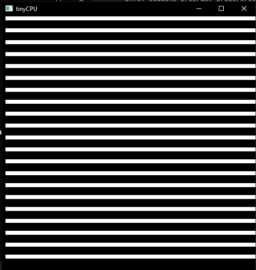

# tinyCPU: Simulating a CPU

## Due Date: 4/26/26

## Description

In this homework, you will be building on the previous homework's ideas to create a fleshed out simulated virtual tinyCPU. You will create the CPU struct complete with shared memory, a program counter, registers, and instruction set. Culminating in you making your own programs in the machine code we develop.

This HW will primarily have you interacting with the fetch->decode->execute loop that is at the core of most CPUs. Rather than building this CPU from the simulated gates up, we will be working more top-down, working from the things that a CPU needs to do and then implementing it into code. 

It should be said that this is not exactly how real CPUs work, after all they do not have the liberty of switch cases or the operators in C. This is however technically a virtual machine simulating a fake CPU that I designed. We could go in and develop each NOT/AND/OR/XOR block, make a bit ripple carry adder, and route everything with a big MUX, however here, we want to develop an understanding of the general process the CPU goes through and the fetch->decode->execute loop.

## The CPU Spec

Before diving into the code, we need to first lay out the spec we are going to be developing. This is something that all CPUs have created as a reference for programmers and hardware manufacturers that codifies the basic operations of the chip and how to interact with it.

It is also used by virtual machine and emulator developers so the can fully simulate the target system they want. If their simulation follows the spec, it can run the same machine code as the real-life machine. We will be taking the role of a simulator developer implementing the spec in C code.

Remember this is an **EXTREMELY** simplified look at both real CPU specs and the process of emulation. However, this can be expanded upon to resemble other fully fleshed out CPU specs given enough time.

Below is the website spec that is a little more explanatory and less true to real CPU specs. I had an LLM Chat bot develop a more real looking spec so you can see how to translate between the two. You can download it [here](./tinyCPU_spec.docx). 

### Overview

tinyCPU is a simple, 8-bit educational processor designed to do the bare minimum functions of a CPU with the intent of being simulated in code and not brought to reality in hardware (although possible). It has the following core functions:

- Instruction Fetch, Decode, and Execute Cycles
- 16 general purpose registers
- A flat memory model
- A simple ALU
- And a frame buffer pixel display (here using ascii)

### Hardware Summary

| Component                 | Specification                                                   |
| ------------------------- | --------------------------------------------------------------- |
| Word size                 | 8 bits (unsigned)                                               |
| Register file             | 16 general-purpose registers: R0 – R15                          |
| Memory                    | 256 bytes of flat, byte-addressable RAM (addresses 0x00 – 0xFF) |
| Program Counter (PC)      | 8-bit, holds byte address of next instruction to fetch          |
| Instruction Register (IR) | 3 bytes wide - holds one fetched instruction (opcode, A, B)     |
| Framebuffer / Screen      | 64 × 64 monochrome pixel grid (W=64, H=64)                      |
| Instruction width         | Fixed 3 bytes: [opcode][operand A][operand B]                   |
| Instruction count         | 20 instructions (opcodes 0 - 19)                                |

### Memory Model

The memory for both program code and data is stored in an array of 256 bytes (0-255 indexes; perfect for a single byte PC). This means that instructions and data share the same instruction space, just like the Von Neumann specification.

Programs are loaded in starting at address 0. Because of the 3-byte long instructions, instructions are accessed every 3 bytes in the memory. This means that instruction N is at byte address N x 3. The PC always holds a single byte address and we use offsets to decode the instruction; PC+0 for the op code, PC+1 for the first operand, and PC+2 for the second operand. After the 3 parts have been decoded, we increment the PC forward by 3.

The jump instructions tell the PC to "jump" to a new address space and resume decoding instructions in the way described above. However note that JMP, JZ, and JNZ jump to the instruction number not the raw address in memory. The CPU will convert it in the following way: byte_address = instruction_number x 3. 

The memory after the last instruction may be used for data that your program can use. This extra space is sometime used for storing things like sprite information for when you want to draw a specific pattern. That space historically has been used for:

- Lookup tables for hard to calculate values (sin/cos, colors, etc)
- String data for messages (if the CPU as a way of doing text output)
- Map data
### Registers

There are 16 registers, numbered 0 through 15 (a nibble ;) ). All registers store an 8-bit, unsigned value for use by the current program. There are no special registers, only general purpose ones. These are your "variables" you will use these to store your intermediate data and need to manage them if a program needs more than 16.

### Instruction Set Architecture

#### Instruction Encoding

Every instruction is exactly 3 bytes:

| Byte 1        | Byte 2    | Byte 3    |
| ------------- | --------- | --------- |
| Opcode (0-19) | Operand A | Operand B |

Both operands are interpreted differently depending on the instruction. If an operand is not being used it should be passed 0 by convention, however there is no enforcement of this.

#### Operand Conventions

In the next section, short-hands will be used to explain the instructions available to us. The following table is the naming conventions used for the operands of that later table:

| Symbol | Meaning                                                                                        |
| ------ | ---------------------------------------------------------------------------------------------- |
| Rd     | Destination register (0 - 15)                                                                  |
| Rs     | Source register (0 - 15)                                                                       |
| Ra     | Address register, this value will be used as a memory address                                  |
| Rc     | Condition register, tested for zero/nonzero checks                                             |
| Rx/Ry  | Register whose value is used as X/Y coordinates for the pixel buffer                           |
| imm8   | 8-bit immediate value (0 - 255), this is used just as the raw value of the byte in the operand |
| target | Instruction number for jumps (byte_address = target x 3)                                       |

#### Opcode Table

The following is the Opcode Table. Every ISA has one and it describes the exact function of each available operation and how to use them.

| #                   | Mnemonic | A      | B      | Operation                                       |
| ------------------- | -------- | ------ | ------ | ----------------------------------------------- |
| **Data Movement**   |          |        |        |                                                 |
| 0                   | LDI      | Rd     | imm8   | Rd = imm8                                       |
| 1                   | MOV      | Rd     | Rs     | Rd = Rs                                         |
| 2                   | LD       | Rd     | Ra     | Rd = mem[Ra]                                    |
| 3                   | ST       | Ra     | Rs     | mem[Ra] = Rs                                    |
| **Arithmetic**      |          |        |        |                                                 |
| 4                   | ADD      | Rd     | Rs     | Rd = Rd + Rs (mod 256)                          |
| 5                   | SUB      | Rd     | Rs     | Rd = Rd − Rs (mod 256)                          |
| **Bitwise / Logic** |          |        |        |                                                 |
| 6                   | AND      | Rd     | Rs     | Rd = Rd & Rs                                    |
| 7                   | OR       | Rd     | Rs     | Rd = Rd \| Rs                                   |
| 8                   | XOR      | Rd     | Rs     | Rd = Rd ^ Rs                                    |
| 9                   | NOT      | Rd     | ---    | Rd = ~Rd                                        |
| 10                  | LSL      | Rd     | Rs     | Rd = Rd << (Rs & 7)                             |
| 11                  | LSR      | Rd     | Rs     | Rd = Rd >> (Rs & 7)                             |
| **Control Flow**    |          |        |        |                                                 |
| 12                  | JMP      | target | ---    | PC = target × 3                                 |
| 13                  | JMPI     | Ra     | ---    | PC = reg[Ra] × 3                                |
| 14                  | JNZ      | Rc     | target | if Rc ≠ 0: PC = target × 3                      |
| 15                  | JZ       | Rc     | target | if Rc = 0: PC = target × 3                      |
| 16                  | HALT     | ---    | ---    | Stop execution                                  |
| **Display**         |          |        |        |                                                 |
| 17                  | DRAW     | Rx     | Ry     | screen[Ry][Rx] = 1                              |
| 18                  | DRAWOFF  | Rx     | Ry     | screen[Ry][Rx] = 0                              |
| 19                  | CLEAR    | mode   | ---    | mode 0: all pixels off \| mode 1: all pixels on |

### ALU Behavior

The ALU supports eight operations: ADD, SUB, NOT, AND, OR, XOR, LSL, and LSR. All arithmetic is performed on unsigned 8-bit values with natural wrap-around (modulo 256). Shift amounts are masked to the low 3-bits (aka ANDed with 7 to make range 0-7 shifts). There are no carry flags, overflow flags, or signed arithmetic modes.

### Framebuffer and Display

The CPU includes a 64 × 64 monochrome framebuffer. Each pixel is either on (1) or off (0). The framebuffer is separate from the 256-byte memory, it cannot be read or written through LD/ST instructions; it is accessible only via DRAW, DRAWOFF, and CLEAR.

Coordinate origin (0, 0) is at the top-left corner. The X axis increases to the right; the Y axis increases downward. Pixel (x, y) maps to screen\[y\]\[x\] in row-major order.  

DRAW sets a pixel on. DRAWOFF sets a pixel off. CLEAR with mode 0 blanks the entire framebuffer; CLEAR with mode 1 fills it completely. Out-of-bounds DRAW and DRAWOFF instructions (x >= 64 or y >= 64) are silently ignored and have no effect.

### CPU Execution Model

The CPU follow a standard three-stage loop:

- **Fetch**: Read 3 bytes from memory at address PC, PC+1, and PC+2 into the instruction register. Increment the PC by 3
- **Decode**: Interpret IR\[0\] as the opcode, IR\[1\] as operand A, and IR\[2\] as operand B
- **Execute**: Carry out the operation, update the registers, memory, framebuffer, or the PC as required

Execution stops when a HALT instruction is executed, or when the PC would advance past address 253 (last valid address for the 3-byte instructions in a 256-bye memory space). An unrecognized opcode is undefined behavior, however for this homework, to aid in debugging, an unrecognized opcode will result in a warning message and then resume normal execution.

### Reset State

When the CPU is initialized or when it is reset, all of the following are zeroed out:

- All 16 registers (R0–R15 = 0)    
- Program Counter (PC = 0)
- Zero Flag (ZF = 0)
- Halted flag (false)
- Memory (all 256 bytes = 0)
- Framebuffer (all 64×64 pixels = 0)

### Program Encoding

tinyCPU programs are loaded into the CPU as flat byte arrays. Each instruction is exactly 3 consecutive bytes: opcode, operand a, and operand b. Programs can be written directly in the runner code or as separate binary files that are read and then loaded into the CPU memory.

Example: Load the value 42 into Register 0 and then halt:

```c
// tinyCPU program using raw opcodes
uint8_t prog[] = {
	0, 0, 42,     // LDI  RO, 42
	16, 0, 0,     // HALT 0, 0
};
```

To aid in programming, there is an enum that labels the opcodes for you and will map them to their opcode numbers to make programming easier:
```c
// tinyCPU program using enum labels
typedef enum {
	LDI=0,
	...
	HALT=16,
	...
	CLEAR=19,
} Op;

uint8_t prog[] = {
	LDI, 0, 42,     // 0, 0, 42,
	HALT, 0, 0,     // 16, 0, 0,
};
```

### Looping Example - Draw a Vertical Line

```c
// Instr# Bytes Meaning
// 0 LDI, 0, 0  R0 = 0 (loop counter / y value)
// 1 LDI, 1, 1  R1 = 1 (increment)
// 2 LDI, 2, 63 R2 = 63 (limit)
// 3 LDI, 3, 31 R3 = 31 (mid x value)
// 4 DRAW, 3, 1 Draw pix at the middle of x and an increasing y
// 5 ADD, 0, 1  R0 += R1
// 6 SUB, 2, 0  R2 -= R0 (becomes 0 when R0 reaches 63)
// 7 JNZ, 2, 4  if R2 != 0 goto instr 2
// 8 HALT, 0, 0

uint8_t prog[] = {
	LDI, 0, 0,   // R0 = 0
	LDI, 1, 1,   // R1 = 1
	LDI, 2, 63,  // R2 = 63
	LDI, 3, 31,  // R3 = 31
	DRAW, 3, 0,  // Draw(R3, R0)
	ADD, 0, 1,   // R0 += R1
	SUB, 2, 0,   // R2 -= R0
	JNZ, 2, 2,   // if R2 != 0 goto instr 2
	HALT, 0, 0,
};
```
### Tiny Assembly

Instead of doing "in-line tinyCPU coding" in C, I have taken the liberty to program and **tinyCPU assembler** so that we can code tinyCPU code inside .tiny files that a program can read. YOUR JOB in this homework is to make the tinyCPU that will run the machine code generated from this assembler. 

The basics to coding in tiny Assembly is:

- Every instruction is 3 parts
	- operation
	- operand a
	- operand b
- The operation is all caps and based on the above table
- Each operand can only be numbers, usually representing target registers for the operation to work on
- Each part is separated by spaces
- Comments are done using `;`
- When doing jump targets for JMP, JZ, and JNZ, these jump to INSTRUCTION numbers, not line numbers nor absolute memory addresses
- Look at the examples in `progs/`

---

## Project Structure

```
CS220-HW5-LastName/
├── include/
│   ├── tinycpu.h             # Your header file
│   └── RGFW.h                # The graphics library
├── src/
│   ├── tinycpu.c             # Your tinycpu implmentations
│   ├── test.c                # Test file
│   └── main.c                # Diver and tinycpu assembler
├── progs/
│   └── *.tiny                # tinyCPU programs
├── answers/                  # Answers for homework short answer questions
│   └── *.tiny 
└── Makefile            # Provided:do not modify
```

All files must compile together:

Windows:

```bash
mingw32-make tinyCPU
mingw32-make test
```

Linux/Mac:

```bash
make tinyCPU
make test
```

Download the starting point [here]().

---

## Part 1: Familiarize Yourself with the Code

Before diving into everything, we should take a stroll through the codebase as it is right now so you can best add to it later. In this section are some questions for you to answer about the code base to steer you in the right direction and test understanding.

1. What is the purpose of `main.c`? How do you use the executable that it makes?
2. What is an assembler? Generally and in this context.
3. After `make tinyCPU` is ran what happens? 
4. What two files are your main concern according to code comments?
5. What is a `.tiny` file?

Answer these inside a `part1.txt` or some other accepted file format inside of the `answers/` folder.

## Part 2: ISA Implementation

With the scaffolding laid, it is your job to fill-in the rest of the ISA for the tinyCPU according to the spec. The first task is to implement both the tinyCPU C struct and its main functions that will simulate the main processes that would occur if the tinyCPU was brought to reality.

### 2.1. The tinyCPU struct

You are to fill-in the tinyCPU struct in `include/tinycpu.h` according to the hardware specification. This is creating the virtual version of the memory and registers available to be used during the run of tinyCPU code. Use the hardware specification documentation as a guide, however here are some general guidelines:

- a "byte" is to be a `uint8_t` value
- the registers and RAM are arrays of bytes
- the instruction register is separate from the general registers
- the screen is a 2D array of either bytes or bools; up to you
- names for struct members are provided to make certain existing functions work
- use provided constant names but fill them in and use accordingly

### 2.2 tinyCPU Main Functions

With the tinyCPU's memory laid out, it is time to fill in the functions that dictate its main operation. Already provided is the main `cpu_run()` function with required rendering support and basic control flow. You are to fill in the rest of the functions.

1. `void cpu_init(tinyCPU* cpu)`
	1. Sets ALL memory associated with the CPU to 0 to start the process of emulation
	2. Use `memset()` to do this in one line reliably, or you can be explicit and set each array and value to 0 manually
2. `void cpu_load(tinyCPU* cpu, uint8_t* prog, size_t len)`
	1. Load `prog` into tinyCPU memory starting at memory address 0
	2. You can do this anyway you like, however if you look up the docs for `memset()` you may find a standard function for copying memory as well if you get stuck
3. `void cpu_fetch(tinyCPU* cpu)`
	1. Use the program counter to get the current instruction and load each part into its byte array
	2. Increment the counter by the instruction length
4. `uint8_t alu_compute(Op op, uint8_t a, uint8_t b)`
	1. Using the provided named enums for the opcode mnemonics, make a big switch statement for each ALU operation, aka ADD, SUB, AND, OR, XOR, NOT, LSL, and LSR
	2. It may seem too simple but just implement them according to the docs using C's operators. The idea is that with these primitive operations we are able to program
	3. Return the result of the operation
	4. Normally this would be a block of gates but here we implement the simple version. Know that ultimately the idea is that so long as we follow the ISA it doesn't matter what it is made out of
5. `void cpu_decode_execute(tinyCPU *cpu)`
	1. This is the combined decode-execute step that will separate out the opcode, operand a, and operand b from the instruction register and then run the correct operation on the CPU memory
	2. Follow the spec sheet above, the summary table is all you need for this part
	3. Use the labels for the machine instructions and implement them according to the description
	4. Keep in mind that we only allow immediate values when we load them into register most of the time, this means that you will be doing a lot of `cpu->reg[a]` rather than just using `a` or `b`
	5. For opcodes DRAW, DRAWOFF, and CLEAR, YOU MUST SET `cpu->needs_render=1`. This signals to the renderer that a screen change has been made and that it must render the screen buffer.

### 2.3 Test Pass

After you are comfortable that you have some code that compiles, you can run the test code. Use:

```shell
make test
```

To build the test executable. That will create `tinyCPU_test`, run it and see how you do. It will highlight the main functionality required for the later steps. 

### 2.4 Run Some `.tiny` Programs

With the tests passing on your implementation, it is safe to test `main.c`'s main functionality as the tinyCPU Assembler. When you run:

```shell
make tinyCPU
```

You will build the tinyCPU Assembler and emulator. It will create `tinyCPU` which you need to run with some command-line arguments. Try this out, you should see a small happy face!

```
tinyCPU progs/sprite.tiny
```

- Run each and describe what they do visually:
	1. `stripe.tiny`
	2. `spiral.tiny`
	3. `ball.tiny`
	4. `sprite.tiny`
	5. `sprite_moving.tiny`

Answer these inside a `part2.txt` or some other accepted file format inside of the `answers/` folder.


## Part 3: Make Your Own `.tiny` Programs

We now have a emulator for a `tinyCPU` complete with a machine code translator! Might as well code some tiny assembly! Using the previously mentioned `.tiny` programs and the spec, you are to make your own programs in this little CPU simulator.

1. `progs/cross.tiny`
	1. Use `stripe.tiny` as a starting point and make a program that will make a cross on the screen, like this:

2. `progs/stripes.tiny`
	1. Use `stripe.tiny` as a starting point and make a program that will make a striping pattern that has white lines separated by **2 spaces each**, like this:

3. `progs/wildcard.tiny`
	1. YOU CHOOSE
		1. Make your own program using the examples given and your creativity
		2. It doesn't need to be crazy and can even be you making your own sprite!
		3. Make sure it doesn't go over 256 bytes

Put all `.tiny` programs in the `progs/` folder.

---
## Grading Rubric

| Section                                                  | Points  |
| -------------------------------------------------------- | ------- |
| Part 1: All five questions answered thoughtfully         | 10      |
| Part 2.1: tinyCPU struct correctly implemented           | 10      |
| Part 2.2a: `cpu_init()` correct                          | 5       |
| Part 2.2b: `cpu_load()` correct                          | 5       |
| Part 2.2c: `cpu_fetch()` correct                         | 8       |
| Part 2.2d: `alu_compute()` all 8 operations correct      | 10      |
| Part 2.2e: `cpu_decode_execute()` all 20 opcodes correct | 17      |
| Part 2.3: All tests passing                              | 10      |
| Part 2.4: Programs run correctly, all 5 described        | 5       |
| Part 3a: `cross.tiny` correct output                     | 8       |
| Part 3b: `stripes.tiny` correct output                   | 8       |
| Part 3c: `wildcard.tiny` creative and functional         | 4       |
| **Total**                                                | **100** |
