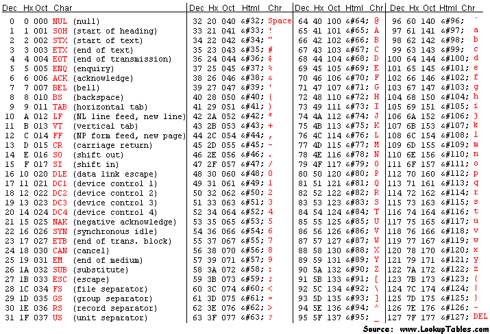
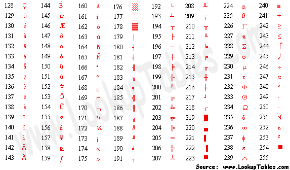

# Number Representations and Signed Numbers

In a [previous lesson](./3_binary_hex.md), we saw different number systems generally and how binary works as a number system. At the end of that lesson, I showed some common sizes of numbers in a computer. While binary numbers can exist as a mathematical concept, we must find ways to represent them on a computer to represent everything from integers to databases of text data. Because of this we must find ways of using fixed-sized binary numbers to represent the types of data that we desire, and make programs that can understand that representation.

In this lesson, we will cover,

- Patterns
- Limits
- Overflows
- Signed vs Unsigned
- Signed Magnitude
- 1's and 2's Complement

## Patterns, Limits, and Overflows

Any information requires a medium to store it, as such all data needs to be physically stored somewhere and through some medium in order for it to be used. Everything on a modern computer is stored via electrical signals used to represent digital data in the form of binary. This means all data and computation is done in binary. 

However, when that binary data is read/written it can be read/written with a specific format in mind. Due to the physicality of storing any type of data, there is a fixed and limited amount of space that can be used to store this data. With these two ideas in mind, we can see that there is a limited number of **patterns** that can be stored by a binary number of a fixed length. Each binary number in the fixed length storage can be used to represent a unique pattern that can later be interpreted by other programs. For example, this is a 2-bit binary variable being incremented, we can think of the simplest pattern being to convert the binary number directly to its decimal representation:

|     | Binary Number | Decimal "Pattern" |
| --- | ------------- | ----------------- |
|     | 00            | 0                 |
| +1  | 01            | 1                 |
| +1  | 10            | 2                 |
| +1  | 11            | 3                 |
| +1  | 00            | 0                 |
| +1  | 01            | 1                 |

As you can see, because there are only 2 digits able to be used there is a limited number of patterns that can be represented. When you try to represent more values than the number of digits allow, you **overflow** back over to the start of the patterns:

| Overflow | Available Space 2-Bits |           |
| --------: | :---------------------- | --------- |
|          | 00                     |           |
|          | 01                     |           |
|          | 10                     |           |
|          | 11                     |           |
| 1        | 00                     | Overflow! |
| 1        | 01                     |           |

The number that would grow into the next digit is instead cut off and the lower order bits reset. 

The number of patterns a binary number with $N$ digits, can represent $2^N$ possible patterns. So before with 2 digits, we get $2^2 = 4$ possible patterns. This makes sense as you can only count from 0 to 3 with 2 digits. For numerical representations this means there are fundamental **limits** on the maximum and minimum values that that a variable can represent.

For **unsigned number representation**, numbers without a sign component i.e. only positive, the limits are set at 0 to $2^N - 1$ as the possible value range. This checks with the previous example. 

Here is a table with common number sizes with their number of patterns and unsigned limits:

| Number Size ($N$) | Number of Patterns ($2^N$) | Unsigned Range ($[0, 2^N-1]$)   |
| ----------------- | -------------------------- | ------------------------------- |
| Bit (1)           | 2                          | [0, 1]                          |
| Nibble (4)        | 16                         | [0, 15]                         |
| Byte/`char` (8)   | 256                        | [0, 255]                        |
| 4-Byte `int` (32) | 4,294,967,296              | [0, 4,294,967,295]              |
| `long int` (64)   | 18,446,744,073,709,551,616 | [0, 18,446,744,073,709,551,615] |

### `char` Patterns

While I am only talking about unsigned decimal form, there are many other possible encodings to attribute to the patterns. One that we use regularly is `char` in C. `char` is both a integer type and a way of representing characters. The code snippet below will show you the number of characters a `char` can represent and the number mapping each one is given:

```c
// chars.c - Program to show the chars
#include <stdio.h>

int main() 
{
	/* Note, by default on most modern compilers all integer types,
	 * including chars, are signed. We cover signed representation
	 * later this lesson. To make sure it is unsigned we will use
	 * the unsigned keyword.
	 */
	unsigned char c = 0; // Start at 0 to show them all

	// Formatting
	printf("|Dec|Hex|Char|\n");

	/* Do-while loop going through all numbers possible for an 8-bit
	 * number. The while statement will only trigger an escape when 
	 * c == 0, ie only when it overflows.
	 */
	do {
		printf("|%03d|%02x |  %c |\n", c,c,c);
		c++;
	} while (c != 0); 

	return 0;
}
```

The decimal numbers between 0-31 and 128-255 `char` representations are now system specific, often being UTF-8, however historically it has been based off of the American Standard Code for Information Interchange (ASCII) character format, with almost all subsequent encodings respecting the following tables entries for 32-127:



In the beginning, there was no standard for the values 128 onwards, and instead the final bit was used for detecting errors. This was until computers began to be networked globally and new additions needed to be added to support more languages. Giving the extended ASCII set:



From there the other representations were created but most derive from ASCII for compatibility reasons. 

This is important to talk about as the 1-byte size for a `char` did not change for many years and represented the set size of one character. Initially they did not use the full pattern space but slowly grew into it and changed what certain parts meant over the years. However, no matter what each one represented each standard was working with the same 8-bits restricted to $2^8$ possible patterns. 

!!! note "Real-World Overflow: IPv4 Address Exhaustion" 
	IPv4 addresses are 32-bit unsigned numbers, giving exactly $2^{32}$ (~4.3 billion) unique addresses. When the internet was designed in the 1970s, this seemed more than sufficient. As global internet adoption exploded, the address space filled up, IANA issued the last block of unallocated IPv4 addresses in **2011**. Stopgap measures like **NAT** (Network Address Translation) allowed many devices to share a single public IP, buying time. The long-term fix is **IPv6**, which uses 128-bit addresses ($2^{128}$; an astronomically larger space). This is a direct, real-world consequence of choosing a fixed-width number representation without anticipating future scale. To learn more, look up *IPv4 exhaustion*, *CIDR*, and *the IPv6 transition*.

## Signed Numbers

Since introducing binary numbers, we have been avoiding the idea of signed binary numbers. **Signed numbers** are number representations that interpret binary data as numbers, both positive and negative. Going off of binary numbers mathematically, we use a sign (-) to indicate if a number is negative or positive. So if we were doing binary math on paper we could indicate the number negative 3 as $-11_2$ and we could go about our merry way. However, that sign represents information and in order for us to use that information, it must be physically stored as binary.

### Signed Magnitude

The simplest method of encoding sign information is called **signed magnitude**. Signed magnitude works under the idea that a number is either positive or negative, a binary relationship. Therefore it should be encoded as a bit in its own right. This bit is always chosen to be the MSB which limits the maximum value able to be reached. This last bit is called the **sign bit**. A signed magnitude number is organized as follows:

| Signed Magnitude (4-bit) |     |             |                   |                  |                 |
| ------------------------ | --- | ----------- | ----------------- | ---------------- | --------------- |
| -5                       | =   | $-1 \times$ | $(2^2 \times 1 +$ | $2^1 \times 0 +$ | $2^0 \times 1)$ |
|                          |     | 1           | 1                 | 0                | 1               |
|                          |     | Sign Bit    |                   |                  | Magnitude       |

If the sign bit is 1, the sum of the other positional numbers before it is multiplied by -1. For to show counting with this system, this table displays a 3-bit signed magnitude number being incremented along with the direct decimal conversion:

| Raw Binary | Signed Magnitude | Decimal |
| ---------- | ---------------- | ------- |
| 000        | 0                | 0       |
| 001        | 1                | 1       |
| 010        | 2                | 2       |
| 011        | 3                | 3       |
| 100        | -0               | 4       |
| 101        | -1               | 5       |
| 110        | -2               | 6       |
| 111        | -3               | 7       |

As you can see this naïve approach to signed numbers results in -0, a number that does not exist and takes up a spot of our limited pattern space. Not only that but the process of addition/subtraction is now conditional based on the magnitudes:

- The process of addition using Signed Magnitude
	- If the signs are the same:
		1. Add the non-sign bits together normally
		2. Return the value with the original sign bit of both inputs
	- If the signs are different:
		1. Find which number + or - is larger in magnitude
		2. Subtract the smaller value from the larger
		3. Return the value with the larger number’s sign

This would be a pain to implement at the CPU level and really inefficient considering how many times we add on a computer (its a lot).  Another drawback is that when overflows happen you jump around in magnitude. The previous table shows going from 3 to 0 and then -3 to 0 again, this is something that all programmers would have to work around and is unintuitive.

To summarize:

- **Pros**
	- Easy to read / implement initially
	- Easy to negate
		- Just flip the MSB
	- Range is symmetric
		- $[-2^{N-1} - 1, 2^{N-1} - 1]$
- **Cons**
	- Two numbers for zero
	- Overflows are unintuitive and annoying 
	- Operations are conditional based on sign and magnitude

The draw backs are glaring and are the reason there are few to zero actual implementations of this signed representation in the modern day, leading to the development of other representations.

### One's Complement

Signed magnitude approached the problem from a perspective that a signed numbers sign is a binary relationship, while true it is not the only trait of signed numbers. Another aspect of signed number is that there is a negation operation that if applied to a number reverses its sign:

- 10 -> -(10) - > -10
- -31 -> -(-31) -> 31

This also means that when applied twice it returns the original value:

- 10 -> -(10) - > -10 -> -(-10) -> 10
- -31 -> -(-31) -> 31 -> -(31) -> -31

**One's complement** aims to replicate this process using a bitwise operator with a similar function, the bitwise NOT. In one's complement, the negation operation is defined to be the bitwise NOT due to its reversibility if applied twice and its ability to reverse the binary number line:

| Dec(A) | A   | ~A  | Dec(~A) |
| ------ | --- | --- | ------- |
| 0      | 000 | 111 | 7       |
| 1      | 001 | 110 | 6       |
| 2      | 010 | 101 | 5       |
| 3      | 011 | 100 | 4       |
| 4      | 100 | 011 | 3       |
| 5      | 101 | 010 | 2       |
| 6      | 110 | 001 | 1       |
| 7      | 111 | 000 | 0       |

The MSB is still viewed to be the sign bit, where if it exists you negate the number to find its unsigned magnitude, resulting in the following table for 3-bit one's complement numbers:

| Raw Binary | One's Complement | Decimal |
| ---------- | ---------------- | ------- |
| 000        | 0                | 0       |
| 001        | 1                | 1       |
| 010        | 2                | 2       |
| 011        | 3                | 3       |
| 100        | -3               | 4       |
| 101        | -2               | 5       |
| 110        | -1               | 6       |
| 111        | -0               | 7       |

This makes for a nicer overflow behavior where we wrap from our max to our min and the zeros wrap back in on themselves. It also fixes part of the problem of addition/subtraction where for the most part you can treat them as if they are unsigned, however there is an edge case to be aware of:

- -3 + 2 = -1
```
 100
+010
----
 110 = -1
```

- In the event of a overflowed carry, add it back in
- 3 + (-1) = 2
```
  1 <- Carry
  011
 +110
 ----
1|001

  1	
 001
+  1
----
 010 = 2
```

- -2 + 2 = 0
```
 101
+010
----
 111 = -0
```

This means you need to write programs that read both 000 and 111 as zero which leads to some annoying checks and error prone code if coders are not careful. Plus, we have yet to solve the issue of the negative -0 which does not exist.

- **Pros**
	- Easy to negate
		- Just apply NOT
	- Range is symmetric
		- $[-2^{N-1} - 1, 2^{N-1} - 1]$
	- Overflows are nice and wrap around 
- **Cons**
	- Still two numbers for zero
	- Slightly harder to read offhand
	- Adding contains one edge case for carry ops

This is a lot easier to handle and fixes the main issue which was conditional adding. Although it still requires adding the carry, but the same operation is used and not conditional on sign or magnitude.

The goal ultimately is to have a system that requires as few edge cases as possible and makes frequent operations like addition easy to implement.

### Two's Complement

While overflowing may seem like a bug that we must work around, it can be used to our benefit.

Recall how one's complement still left us with two representations of zero. The root cause is that the bitwise NOT maps 0 to its "mirror" on the other end of the number line, and those two endpoints are both zero-adjacent. What if instead of landing exactly on $-0$, we shifted the entire negative half of the number line by one? That is precisely what **two's complement** does.

Two's complement defines negation as the bitwise NOT **plus one**:

$$-A = \sim A + 1$$

Let's verify that applying this twice returns the original value, as any self-respecting negation operation should:

- Start with $A$
- Apply once: $\sim A + 1$
- Apply again: $\sim(\sim A + 1) + 1 = A - 1 + 1 = A$ 

Another way to think about two's complement (and the way hardware actually interprets it) is that the MSB carries a **negative** positional weight. In an $N$-bit two's complement number, the MSB has weight $-2^{N-1}$ while all lower bits keep their normal positive weights:`

| Two's Complement (4-bit) |     |                      |                   |                   |                |
| ------------------------ | --- | -------------------- | ----------------- | ----------------- | -------------- |
| -5                       | =   | $-(2^3) \times 1\ +$ | $2^2 \times 0\ +$ | $2^1 \times 1\ +$ | $2^0 \times 1$ |
|                          |     | 1                    | 0                 | 1                 | 1              |
|                          |     | Sign Bit ($-8$)      |                   |                   | Magnitude      |

So $1011_2 = -8 + 0 + 2 + 1 = -5$. This means you can decode any two's complement number directly without needing to negate anything, just treat the MSB as a negative power of two and sum the rest normally.

The resulting bit patterns for a 3-bit number look like this:

|Raw Binary|Two's Complement|Decimal|
|---|---|---|
|000|0|0|
|001|1|1|
|010|2|2|
|011|3|3|
|100|-4|4|
|101|-3|5|
|110|-2|6|
|111|-1|7|

Notice that $-0$ is gone entirely. Applying two's complement negation to `000` gives ~`000` + 1 = `111` + 1 = `000`; zero maps to itself, as it should.

The tradeoff is that the range is now **asymmetric**: there is one extra negative value with no positive counterpart. For 3 bits, that is $-4$. In general the range is $[-2^{N-1},\ 2^{N-1} - 1]$.

#### Addition in Two's Complement

The payoff for this extra negative value is that addition requires **zero special cases**. Simply add the bits as if they were unsigned and discard any carry out of the MSB:

- 3 + (-1) = 2

```
  011
+ 111
-----
1|010  →  discard carry  →  010 = 2  
```

- (-3) + 1 = -2

```
  101
+ 001
-----
  110 = -2  
```

- (-1) + 1 = 0

```
  111
+ 001
-----
1|000  →  discard carry  →  000 = 0  
```

No carry-add step, no sign checks, no magnitude comparisons, the hardware just adds. This is why virtually every modern CPU uses two's complement for signed integers.

#### Negating a Two's Complement Number

To negate any value, flip all the bits then add one:

|Value|Binary|Step 1: NOT|Step 2: +1|Result|
|---|---|---|---|---|
|3|011|100|101|-3|
|-2|110|001|010|2|
|1|001|110|111|-1|
|-4|100|011|100|-4 (!)|

That last row is not a mistake. $-4$ has no positive counterpart in 3-bit two's complement, attempting to negate it wraps back to itself. This is the one quirk to be aware of when working near the minimum value of the range.

- **Pros**
    - Single representation of zero
    - Addition and subtraction require no special cases
    - Carries out of the MSB are safely discarded
    - Overflow wraps naturally from max positive to min negative
- **Cons**
    - Asymmetric range: one more negative value than positive
    - Negation requires two operations (NOT then +1)
    - Minimum value cannot be negated within the same bit width

Two's complement is the dominant signed integer representation in modern hardware and is what C, C++, Java, and virtually every other systems language uses under the hood.

---

## Summary Tables

### All Representations on a 3-Bit Number

|Raw Binary|Unsigned|Signed Magnitude|One's Complement|Two's Complement|
|---|---|---|---|---|
|000|0|0|0|0|
|001|1|1|1|1|
|010|2|2|2|2|
|011|3|3|3|3|
|100|4|-0|-3|-4|
|101|5|-1|-2|-3|
|110|6|-2|-1|-2|
|111|7|-3|-0|-1|

### Range Comparison ($N$-bit numbers)

|Representation|Minimum|Maximum|Distinct Zeros|Notes|
|---|---|---|---|---|
|Unsigned|$0$|$2^N - 1$|1|Full pattern space used|
|Signed Magnitude|$-(2^{N-1}-1)$|$2^{N-1} - 1$|2 (+0 and -0)|One pattern wasted on -0|
|One's Complement|$-(2^{N-1}-1)$|$2^{N-1} - 1$|2 (+0 and -0)|One pattern wasted on -0|
|Two's Complement|$-2^{N-1}$|$2^{N-1} - 1$|1|Asymmetric; no wasted patterns|

For the common **8-bit (`char`) case** these work out to:

|Representation|Minimum|Maximum|
|---|---|---|
|Unsigned|0|255|
|Signed Magnitude|-127|127|
|One's Complement|-127|127|
|Two's Complement|-128|127|
