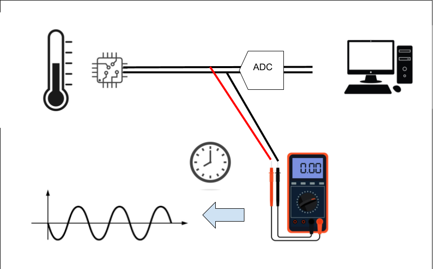
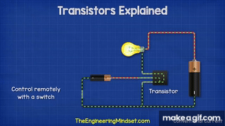
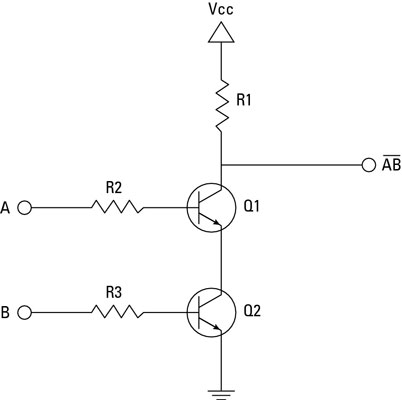

# Transistors To Computers: Gates->Circuits->CPUs

With the language of binary and logical operations planted firmly in your brain, we can begin to see the bigger picture how we build up from transistors to modern computers. Transistors are the "atom" of a contemporary CPU and represents the smallest unit of abstraction for the most part. How these simple electronic switches build up to computers is interesting, rewarding to learn, and universal to how most modern computers work.

In this lesson, we will cover:

- Big Picture Computer Abstraction
- Gates and Circuits
- Computer Microarchitectures
- Machine Code

## The Abstraction Hierarchy

In many ways this lesson will be the big picture view of how a computer works at a surface level to introduce the next group of topics more in depth. We will be diving deeper into each individually in later lessons, however to ensure we do not get lost along the way, we need a map to understand everything generally before the end. 

At the beginning of the course, the **Abstraction Hierarchy** was introduced through this image:

![Layers of abstraction diagram. From top to bottom, "Application", "Algorithm", "Programming Language", "Assembly Language", "Machine Code", "Instruction Set Architecture", "Micro Architecture", "Logic Gates, Registers", "IC's and Transistors", and, "Electronics and Physics". On the left are two scales of magnitude. The first is Complexity, indicating that the "Application" layer is the least complex and the "Electronics and Physics" layer as most complex, with everything in between rated by their organization. The second scale is "Abstraction", indicating that the "Application" layer is the most abstract and the "Electronics and Physics" layer as least abstract, with everything in between rated by their organization. There is a division on the right separating Software and Hardware, centered at "Instruction Set Architecture", signifying that everything above is "Software" and everything below as "Hardware".](../img/Layers-Of-Abstraction.jpg)

Here we can see the different levels of how we build up to the device you are reading this lesson on. At the top, the applications we use on the computer that never show us a line of code or wire of circuit board. At the bottom, the underlying physics that we exploit to accomplish the computational tasks we desire, electricity and thermodynamics. Every step along the way to get there requires levels of increasing complexity that layer on top of one another, to the point where attempting to view the entire thing at once is nearly impossible. These various layers are what we will examine in order to fully understand the process of using electricity to compute anything. 

The compilation lab works from going down from the application layer, breaking down how all programs eventually breakdown to machine code running on the CPU. This top-down approach helps reveal how our instructions get translated along the way to the lowest level on the computer that we, as programmers, usually see. The abridged lesson from that lab breaks down as follows:

- **Applications** are made using programs implementing **algorithms** written in **programming languages**, like C
- C is human readable, and cannot run on a CPU directly, it only **"speaks in binary"**
- C is translated to **assembly code**, which is closer to how a computer understands, but still is human readable
- That **assembly code** is interpreted as **binary machine instructions**
- Those instructions are dictated by the **instruction set architecture (ISA)** 

This is the process of how we are able to communicate to the computer, however it is not how it works, just how to tell it what to do. This is largely the reason why we needed to cover binary before this point, it is the common language we have to being able to communicate with the computer at almost every level. Binary is also the system that the entire system is built upon from the underlying circuitry. 

To understand how a computer works we need to know what it is trying to do in the first place. The modern idea of **computation** was first developed by Alan Turing and Alonzo Church in the 1930s. They were attempting to find out what sorts of problems can be solved in the first place when they realized that any problem that can be solved by following a finite set of rules can, in theory, be automated. They then formalized the idea of **computation** and **programs** as series of instructions that can be followed in a sequential order to solve problems. Computers were first theorized as hypothetical machines that carry out very simple operations, but nonetheless can solve any solvable problem. This was famously done with the Turing Machine, a formal mathematical description of a minimal computer that exists only on paper. 

Above is an image of a representation of a Tuning Machine. It consists of a head that sits on a tape of cells filled with binary digits that it can read, write, and move left/right on. What the head does is controlled by a "finite state machine" that describes its function, essentially its program. Based on information read and the program in the state machine, the Turing Machine uses the tape to solve arbitrary problems. While only a thought experiment, it represents the simplest abstraction of what a computer is doing, reading and writing data based on a program. It also defines Turing Completeness; whether a system is able to solve any computable problem. If a machine can simulate a Turing Machine, it can solve anything. The minimum requirements for something to be Turing Complete are:

- Read and write data to memory
- Perform conditional branching
- Loop or repeat operations
- The possibility of having infinite memory
	- This means that the fundamental mechanism is not limited in its access in memory. Even though infinite memory is physically impossible, we can expand to allow for it to be approached

If a system has these capabilities it is Turing Complete and is considered a general computer. All modern computers are made with these assumptions underlying and it motivates all decisions when designing CPUs at a low level.

There are an infinite number of ways to accomplish the above, see:

- Minecraft Computer ([Link](https://www.youtube.com/watch?v=jTZaUz8bYW8))
- Fluid Computers ([Link](https://en.wikipedia.org/wiki/Fluidics))
- Quantum Computers (Look it up...)
- Unconventional Computers ([Link](https://en.wikipedia.org/wiki/Unconventional_computing))

However in the modern day we primarily exploit electricity and transistors as the base level medium to implement a computer.

## Transistors, Gates, and Circuits

Electricity is the flow of electrons through a medium; wire, air, silicon, anything that can hold a charge. Electricity maps well for representing binary (the simplest form of information); a current is either on or off, usually represented as high or low voltage for 1 and 0. Like most things in reality, electricity exists in an analog form or existing on a continuous range of infinite values.  Meaning a wire can have 0.0 volts flowing through it, or 1.0, or 0.5, or 0.24361, or anything in between and beyond those examples. Additionally, when a circuit is running, very rarely is there exactly 0.0 volts flowing on the wire, so simple on/off detection is very error prone. This requires a discretizing of the analog signal to turn it from infinite to being read as one of two set possibilities.  Below is an analog signal that is coming from a temperature reader sending a signal for the temperature in binary over a wire, the x-axis is time and the y-axis is the voltage value of the wire at that time step:

The signal above is the raw analog electrical signal coming from the circuit before it is read by the computer. This signal cannot be sent directly to the CPU, in most cases it would fry it because of the difference in voltage/current, but regardless it is in analog form. It first needs to be converted to a discrete representation in order for it to be parsed as information downstream. That ADC on the diagram stands for Analog Digital Converter, and it is a circuit that reads voltage values over time and turns them into a discrete, digital signal that can be easily read by a computer as 1's and 0's. The red line represents the digital output from the ADC, it is generated by sampling the voltage at a constant rate and then interpolating those signals over time. The red dots represent these samples:

The sample rate is how often the reading is made and is the "clock speed" of the information being transmitted on the wire. This clock speed is also how fast later operations of the computer are made and is the speed that the smallest operations of the computer are ran at. 

This is how most information is sent over the wires in any digital circuit and is how we transmit any data over copper wires, fiber optics, and WIFI. It is also how we build up to logical circuits that take in numbers over the wires and will spit out the correct answer to a mathematical operation in binary. 

With how binary is represented over the wires, we can start to build up to how we accomplish that Turing Complete system using electrical components. 

### Transistors

In order to use electricity to accomplish computation we must control the flow of electrons automatically using other electrical signals. This feedback loop of signals being able to control signals is essential for all of computing, this allows for the automatic execution of different circuits based on the instructions from a program. The fundamental building block that all modern computers use to enable this is the **transistor**.

A transistor is an electric switch that either allows or disallows the flow of electricity:

It has three terminals: a source, a drain, and a gate. When a high voltage is given to the gate terminal, it allows current to flow from the source to the drain, switching the drain wire to "on", representing a 1. The nature of a transistor is solely to control the flow of electricity based on an input signal. This simplicity is built upon by chaining multiple transistors and allowing their structure dictate their function, creating complex systems that are able to do all mathematical operations. Modern CPUs contain billions of transistors etched into silicon wafers at sizes measured in nanometers. At that scale, they switch between on and off billions of times per second. But despite that staggering complexity, every single one of them is doing the same simple job: acting as a switch.

However, to build upon those simple foundations to create systems of any task, one must first create **logic gates**.

### Logic Gates

Given electricity as a medium for binary information, the next "logical" step would be to implement the basic logical operators within that medium. Logic gates are the transistor implementation of the logical operators that we have previously covered; NOT, AND, OR, XOR, NAND, and NOR. We have seen previously we can use logic gates for number tricks in binary, like finding out if a number is even/odd and negating a number in Two's Complement. Much like those examples, we will exploit the power of logic to accomplish anything. Once the basic gates are created, they can be multiplied and chained many times over and built up to the first real layer of abstraction on top of transistors.

The above is a circuit diagram of a NAND gate using transistors. You can ignore the zigzag lines, they are resistors for the breadboard implementation. Signal A and B come in and control the gate terminals of transistors Q1 and Q2. When A and B are HIGH, they both allow the flow of electricity flow to ground, causing the output terminal to read LOW. If either or both A and B are LOW, the voltage from Vcc is able to flow through to the output terminal and read as HIGH. This gives a NAND gate. Note this not the correct or only way to do this, I found this one as an example that one can create on a breadboard. 

One thing to note at this step, the NAND gate, AND with a NOT'ed output, is **functionally complete** meaning we can exclusively use NAND gates to create all other logical gates. This means that once you can create a NAND gate, that structure can be copied over and over again without the need for many other structures on a circuit board/silicon wafer. 

### Circuits

Individual gates become useful when we wire them together into **circuits** that perform meaningful operations on binary numbers. The classic first example is the **half adder**: a circuit that adds two single bits together. It turns out this only requires two gates, an XOR gate to produce the sum bit, and an AND gate to produce the carry bit. From there, chaining half adders together with some OR gates produces a **full adder**, which can add two bits _and_ account for a carry in from a previous addition. Chain enough full adders together and you have a circuit that can add two arbitrary binary numbers, this is called a **ripple carry adder**, and it is the heart of arithmetic in a CPU.

Whether using all NAND gates or other implementations of the logical gates, from there we need to construct circuits capable of addition, multiplication, and all other arithmetic operations. We also would need to create circuits capable of controlling those arithmetic operations, calling different arithmetic circuits on specific inputs and outputting the results. These two motivations motivate the creation of micro architectures, specifically the **Von Neumann Architecture's** **Central Processing Unit (CPU)** and its **Control Unit (CU)** and **Arithmetic and Logic Unit (ALU)**. 

## CPU, ALU, and YOU!

In order to organize these task specific circuits and control their processes efficiently, **micro architectures** needed to be developed. A micro architecture is an organizational scheme that specifies the overall structure and main circuit groupings according to their responsibility. One of the most fundamental architectures that most modern systems built upon is the **Von Neumann architecture**.

The Von Neumann architecture is as follows:

- **The Central Processing Unit (CPU)** - The main computational workhorse, here the CPU reads machine instructions and executes them. It is made of two parts:
	- **Control Unit** - Used to sequence operations to be performed by the machine, orchestrating the other components
	- **Arithmetic/Logic Unit** - Used to perform the instructions from the control unit on the memory unit
- **Memory Unit** - A bank of memory that stores both instructions and data in the same address space
- **Input Device** - The source of information into the CPU, can be new instructions or data
- **Output Device** - Receives information from the CPU and routes it to other devices for control signals

The main feature is the separation of control logic and arithmetic/logic operations within the CPU. The CU reads instructions from memory and sets up the inputs for the arithmetic operations. The gates in this section are made to decode the machine code instructions into hardware signals that will activate ALU circuits to accomplish mathematical tasks. The ALU is a section of the CPU that is a collection of circuits that specialize in mathematical operations as well as large scale, bit-wise versions of the logic operators. This unit reads in the control instructions from the CU and will activate a math operation circuit on a specific piece of memory and write the results. Itself has no higher level control or looping behavior, that is controlled by the CU, rather it is like a calculator used by the CU to accomplish the steps needed to carry out the machine code program.

At this level, a machine code instruction amounts to a digital signal with 64-bits either on or off that control how the computer works on the RAM memory. The program is a series of these 64-bit numbers that are stored in memory and fed to the CU as input. The machine code instruction signals are physically controlling what transistors do what — which gates open, which arithmetic circuits activate, and which memory addresses get read or written. Every instruction the CPU executes is ultimately just a pattern of high and low voltages rippling through billions of switches, producing the right result because the physical arrangement of those switches was designed to do exactly that. We will look at this closer another day.

