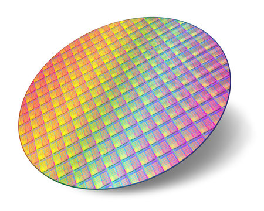

# Gates and Circuits: From Transistors to Computation

With boolean logic and bitwise operations planted firmly in your brain, we can now see exactly how those ideas are physically realized in hardware. Every NOT, AND, and XOR you wrote in C has a direct counterpart in silicon; a circuit made of transistors that produces that exact truth table, billions of times per second. Here will will begin to construct up from transistors to the basic logic gates, and the first circuits that make up modern CPUs. 

In this lesson, we will cover:

- What a logic gate actually is in silicon
- The seven fundamental gates and CMOS transistor implementations
- NAND Functional Completeness
- Half Adders, Full Adders, and Ripple Carry Circuits 

## From Transistors to Gates

Recall from the abstraction hierarchy lesson: a transistor is an electrically controlled switch. Give the gate terminal a HIGH voltage and current flows from source to drain. Give it LOW and it blocks. That is the entire job of a transistor, nothing more.

The key insight is that if you wire transistors together in specific configurations, their combined behavior implements a logical operation. Two transistors in the right arrangement produce a NAND gate. A NAND gate plus a few more transistors gives you AND, OR, or anything else. Real-world gate transistor counts in CMOS (the dominant manufacturing process) look like this:

|Gate|Transistor count|
|---|---|
|NOT (inverter)|2|
|NAND|4|
|NOR|4|
|AND|6 (NAND + NOT)|
|OR|6 (NOR + NOT)|
|XOR|8–12|

Chip designers almost always build everything from NAND or NOR internally because they require the fewest transistors, then derive every other gate they need from those.

**CMOS (Complementary metal-oxide-semiconductor)** is the type of transistor fabrication process that produce most modern CPUs and other integrated circuits (IC). At its core, the process is printing circuits on silicon wafers using metal oxide layers. 




Below are the seven logical gate implemented in their CMOS transistor versions. It is not fully important to memorize these layouts, rather take node of their complexity. At the core of everything we do as programmers are logic gates, each simple in concept but take an overwhelming amount of complexity to implement. Later, when you see adders, think about how many transistors must be printed for a 4-bit ripple carry adder, there are a lot.

### The Seven Gates

#### NOT


The simplest gate: one input, one output. It flips the bit.

|$a$|$\lnot a$|
|---|---|
|0|1|
|1|0|

#### AND


Two inputs. Output is 1 only when **both** inputs are 1. 

|$a$|$b$|$a \land b$|
|---|---|---|
|0|0|0|
|0|1|0|
|1|0|0|
|1|1|1|


#### OR


Output is 1 when **at least one** input is 1.

| $a$ | $b$ | $a \lor b$ |
| --- | --- | ---------- |
| 0   | 0   | 0          |
| 0   | 1   | 1          |
| 1   | 0   | 1          |
| 1   | 1   | 1          |

#### XOR


Output is 1 when the inputs are **different**. When inputs match, output is 0.

|$a$|$b$|$a \oplus b$|
|---|---|---|
|0|0|0|
|0|1|1|
|1|0|1|
|1|1|0|

In C: `a ^ b`. XOR has two remarkable properties: `a ^ a = 0` (anything XORed with itself is zero) and `a ^ 0 = a` (anything XORed with zero is unchanged). These make it the backbone of binary addition and a core primitive in encryption.

#### NAND, NOR, XNOR

Each of these is just AND, OR, or XOR with a NOT on the output:

- **NAND**: NOT AND. Output is 0 _only_ when both inputs are 1, otherwise 1.
- **NOR**: NOT OR. Output is 1 _only_ when both inputs are 0, otherwise 0.
- **XNOR**: NOT XOR. Output is 1 when inputs are _equal_.


|$a$|$b$|NAND|NOR|XNOR|
|---|---|---|---|---|
|0|0|1|1|1|
|0|1|1|0|0|
|1|0|1|0|0|
|1|1|0|0|1|

XNOR is particularly useful for equality checking: its output is 1 when both bits match and 0 when they differ. String together eight XNOR gates and AND their outputs and you have a circuit that tells you whether two bytes are identical.

## Functional Completeness: Why NAND Rules Everything

A gate, or set of gates, is **functionally complete** if you can construct any other logic function using only that gate. NAND is functionally complete on its own. So is NOR. Here is how every other gate can be built from NAND alone:

```
NOT a         =   a NAND a
a AND b       =   NOT(a NAND b)
a OR b        =   (NOT a) NAND (NOT b)
a XOR b       =   ((a NAND b) NAND a) NAND ((a NAND b) NAND b)
```

This is not just a theoretical curiosity; it has a direct consequence for chip manufacturing. Etching a chip into silicon means depositing patterns of material at nanometer scale. If you only need **one** kind of structure to build everything, your fabrication process is dramatically simpler and cheaper. Real CPUs are largely a sea of NAND (or NOR) cells internally, with the logical function determined entirely by how they are wired, not by using physically different components.


In C, this maps directly to a constraint you will encounter in the homework: if the only primitive you are allowed is `nand()`, you can still build the entire project. That is functional completeness in code.

## Building Circuits

Individual gates become useful when wired together into **circuits** that perform operations on multi-bit numbers. This is where the connection to arithmetic becomes concrete.

### The Half Adder

The simplest arithmetic circuit is the **half adder**. It adds two 1-bit numbers and produces two output bits: a **sum** bit and a **carry** bit. Consider what 1-bit addition looks like:

```
0 + 0 = 0   (sum = 0, carry = 0)
0 + 1 = 1   (sum = 1, carry = 0)
1 + 0 = 1   (sum = 1, carry = 0)
1 + 1 = 10  (sum = 0, carry = 1)
```

Look at the sum column: it is 0 when inputs match and 1 when they differ; that is exactly XOR. Look at the carry column: it is 1 only when both inputs are 1; that is exactly AND. So the entire half adder is just **two gates**:

```
Sum   = a XOR b
Carry = a AND b
```


That simplicity is what makes binary so well suited for hardware. The truth tables of arithmetic operations align directly with the truth tables of logical operations, so arithmetic falls out of gate circuits almost for free.

The full truth table for the half adder:

|A|B|Sum|Carry|
|---|---|---|---|
|0|0|0|0|
|0|1|1|0|
|1|0|1|0|
|1|1|0|1|

### The Full Adder

A half adder can only add two bits. Real numbers are many bits wide, and when you add them column by column — just like long addition in decimal — each column can receive a **carry in** from the column to its right. A **full adder** handles three inputs: A, B, and carry-in (Cin). It produces a sum bit and a carry-out.

A full adder is built from **two half adders and one OR gate**:

```
Half adder 1:  (A, B)        -> (sum1, carry1)
Half adder 2:  (sum1, Cin)   -> (Sum,  carry2)
OR gate:       carry1 | carry2 -> Cout
```

The OR at the end is needed because a carry-out can be generated by either half adder, and we want to pass it along if either one fires.


The full truth table for the full adder:

|A|B|Cin|Sum|Cout|
|---|---|---|---|---|
|0|0|0|0|0|
|0|0|1|1|0|
|0|1|0|1|0|
|0|1|1|0|1|
|1|0|0|1|0|
|1|0|1|0|1|
|1|1|0|0|1|
|1|1|1|1|1|

### The Ripple Carry Adder

Chain N full adders together and you can add two N-bit numbers. This structure is called a **ripple carry adder** because the carry bit _ripples_ from the lowest bit (bit 0, the LSB) toward the highest (bit N-1, the MSB) one stage at a time, each full adder must wait for the carry from the stage below it before it can produce its own output.


The carry out of the MSB full adder is the hardware signal for **integer overflow**, exactly the overflow behavior described in the signed numbers lesson. When the carry exits the top of the chain, the result no longer fits in N bits.

This waiting on carry propagation is the main performance bottleneck for this design. A 64-bit ripple carry adder must wait for 64 sequential carry propagations before the result is valid. Modern CPUs use **carry-lookahead adders** that calculate carry bits speculatively and in parallel, but the ripple carry adder is the conceptual foundation for all of them.

## Other Critical Circuits

The adder is the most famous example, but a CPU needs several other circuit types to function. In the next lesson we will cover:

- The Multiplexer (MUX)
- The Decoder
- Flip-Flops and Latches
- The ALU

## Connecting It Back: Gates to CPU

The abstraction hierarchy from the earlier lesson now has concrete grounding at every layer:

- **Transistors** are switches controlled by voltage
- **Gates** are transistor arrangements implementing logical operations
- **Circuits** are gates wired together to perform arithmetic and routing
- **Flip-flops** are feedback gate circuits that store state
- **Registers and the ALU** are organized collections of circuits performing the CPU's core work
- **The control unit** decodes binary machine instructions and sends selector signals to MUXes and the ALU to configure which circuit operates on which data

Every line of C code you write, every addition, every `if` statement, every array lookup ultimately decomposes into a pattern of 1s and 0s that ripples through billions of these gates. The simplicity of each individual component is precisely what makes the staggering complexity of the whole system possible; each layer hides the details of the layer below it, and you only need to think at the level you are working at.
